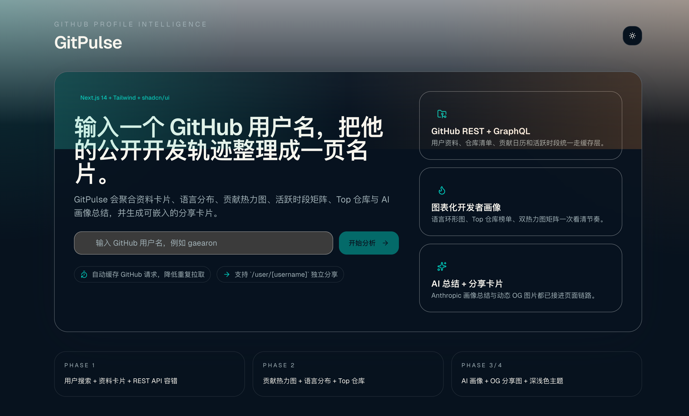

# GitPulse

在线网址：https://gitpulse-one.vercel.app

GitPulse 是一个基于 `Next.js 14 App Router`、`Tailwind CSS` 和 `shadcn/ui` 的 GitHub 开发者画像应用。输入任意 GitHub 用户名后，应用会聚合用户资料、仓库分布、贡献热力图、活跃时段和 AI 总结，并生成可分享的动态 OG 卡片。



## 功能列表

- GitHub 用户搜索：首页输入用户名后跳转到 `/user/[username]`。
- 用户资料概览：展示头像、bio、followers、公开仓库数、近期活跃度与总 Star。
- API 容错与限流提示：区分用户不存在、GitHub REST/GraphQL 请求超限、缺少令牌等状态。
- GitHub OAuth 登录：支持用户登录后使用自己的 GitHub API 配额，缓解公共部署的共享限流问题。
- 语言分布环形图：基于用户公开仓库的 `language` 字段，用 `Recharts` 渲染。
- Top 仓库排行榜：按 Star 数排序，展示描述、语言、更新时间。
- 贡献热力图：通过 GitHub GraphQL `contributionsCollection` 获取年度贡献日历，并提供自定义配色主题。
- 活跃时段分析：按星期和小时聚合 commit 时间戳，渲染热力图矩阵。
- 编码习惯标签：根据语言、提交时段和更新节奏生成如“夜猫子”“周末战士”等标签。
- AI 总结：基于语言分布、仓库类型、活跃时段生成 2-3 句中文画像（使用 Google Gemini 免费 API）。
- 动态 OG 图片：`/api/og/[username]` 生成可分享卡片，并支持复制 Markdown 嵌入代码。
- 亮色/暗色主题：支持切换主题，并包含首页与详情页骨架屏和移动端适配。

## 技术栈

- Next.js 14 App Router
- Tailwind CSS
- shadcn/ui 组件目录组织
- Recharts
- GitHub REST API + GitHub GraphQL API
- Google Gemini API（免费层）
- `next/og` 动态 OG 图片

## 本地运行

### 1. 安装依赖

```bash
npm install
```

### 2. 配置环境变量

```bash
cp .env.example .env.local
```

推荐至少配置以下变量：

| 变量名 | 说明 |
| --- | --- |
| `GITHUB_OAUTH_CLIENT_ID` | 推荐生产环境必须配置。GitHub OAuth App 的 Client ID，用于公共模式与用户登录。 |
| `GITHUB_OAUTH_CLIENT_SECRET` | 推荐生产环境必须配置。GitHub OAuth App 的 Client Secret，只能保存在服务端。 |
| `GITHUB_OAUTH_REDIRECT_URI` | OAuth 回调地址，默认是 `http://localhost:3000/api/auth/github/callback`。 |
| `SESSION_SECRET` | 用于加密登录后的 session cookie，建议使用至少 32 字节随机字符串。 |
| `GITHUB_TOKEN` | 可选的服务器侧后备令牌。适合本地开发或内部部署，但公网产品更推荐 OAuth App。 |
| `GEMINI_API_KEY` | 启用 AI 画像总结。在 [aistudio.google.com/app/apikey](https://aistudio.google.com/app/apikey) 免费申请，免费额度 1500 次/天（Gemini 2.0 Flash），无需信用卡。 |
| `GEMINI_MODEL` | 可选，自定义 Gemini 模型名，默认 `gemini-2.0-flash`。 |
| `NEXT_PUBLIC_APP_URL` | 站点公开地址，用于 OG 图片和 Markdown 嵌入链接。 |

### 3. 启动开发服务器

```bash
npm run dev
```

打开 [http://localhost:3000](http://localhost:3000)。

### 4. 配置 GitHub OAuth App

如果你要把 GitPulse 部署给其他人使用，建议在 GitHub 里创建一个 OAuth App，并把回调地址设为：

```text
http://localhost:3000/api/auth/github/callback
```

线上部署时改成你的正式域名，例如：

```text
https://gitpulse.your-domain.com/api/auth/github/callback
```

应用拿到 `client_id + client_secret` 后，未登录访客会优先走 OAuth App 的公共额度；登录用户则会切到自己的 GitHub 配额。

### 5. 常用校验命令

```bash
npm run typecheck
npm run lint
npm run build
```

## 在线 Demo

- 示例部署地址：[gitpulse.vercel.app](https://gitpulse.vercel.app)
- 如果你还没有部署，请把这个链接替换成自己的 Vercel 域名，并同步更新 `NEXT_PUBLIC_APP_URL`

## 关键目录

```text
src/app/page.tsx                    首页搜索入口
src/app/user/[username]/page.tsx    用户画像详情页
src/app/api/auth/github/*           GitHub OAuth 登录与回调
src/app/api/og/[username]/route.tsx 动态 OG 图片
src/lib/github.ts                   GitHub REST/GraphQL 数据层与缓存
src/lib/auth.ts                     GitHub 鉴权与 session 工具
src/lib/analytics.ts                语言/活跃时段/标签分析逻辑
src/lib/ai-summary.ts               AI 总结调用（Gemini）
```

## 说明

- 未配置任何 GitHub 鉴权时，首页与基础资料页仍可工作，但会退回匿名共享额度，容易被限流。
- 配置 `GITHUB_OAUTH_CLIENT_ID` / `GITHUB_OAUTH_CLIENT_SECRET` 后，未登录访客也能走应用公共额度；登录用户会进一步切到自己的配额。
- `GITHUB_TOKEN` 仍可作为后备方案存在，但更适合开发和内部部署，不适合作为公网产品唯一额度来源。
- GitHub 请求触发速率限制时，页面会展示重试时间，而不是直接报错崩溃。
- AI 画像总结默认是可选增强项，不会阻塞主页面渲染。
